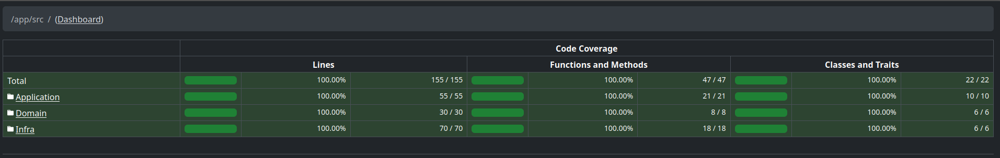

# 📚 Estudos de Design Patterns em PHP

Este repositório reúne estudos práticos e aprofundados sobre **Design
Patterns aplicados em PHP**, com foco em arquitetura limpa, boas
práticas e organização modular.\
Aqui você encontrará exemplos reais, estruturados e comentados de
diferentes padrões utilizados em aplicações modernas.

O objetivo do projeto é servir como um **laboratório de aprendizado**,
concentrando:

-   Implementações individuais de cada pattern
-   Exemplos práticos em código
-   Comparação entre padrões semelhantes
-   Demonstração de como se comportam em cenários reais
-   Documentação clara e orientada para estudo

------------------------------------------------------------------------

# 🧰 Pré-requisitos

Para executar o projeto localmente, você precisará ter instalado:

-   **Docker**
-   **Docker Compose**

O ambiente de desenvolvimento e execução é totalmente containerizado,
garantindo isolamento, reprodutibilidade e facilidade de setup.

------------------------------------------------------------------------

# 🛠️ Ferramentas utilizadas

O projeto utiliza um conjunto de ferramentas para garantir qualidade de
código, padronização e segurança:

### ✔ **Husky (pre-commit hooks)**

Responsável por executar automaticamente validações antes de cada
commit, garantindo que nenhum código fora do padrão seja enviado ao
repositório.

### ✔ **PHPStan**

Ferramenta de análise estática para detectar erros antecipadamente e
reforçar boas práticas.

### ✔ **PHPUnit**

Framework de testes utilizado para garantir o funcionamento correto de
cada padrão implementado.

### ✔ **PHP-CS-Fixer**

Padroniza o estilo do código automaticamente, mantendo consistência e
legibilidade em todo o repositório.

------------------------------------------------------------------------

# 🧪 Cobertura de Testes

📊 **O projeto possui cobertura total: 100%**

Todos os patterns e suas variações contam com testes automatizados
garantindo confiabilidade e demonstrando como cada pattern deve se
comportar em situações reais.



------------------------------------------------------------------------

# 🧩 Design Patterns Implementados

Cada pattern listado abaixo possui um espaço reservado para exemplos em
código, que serão adicionados conforme a evolução do projeto.

------------------------------------------------------------------------

### **1. DTO (Data Transfer Object)**

Objetos simples utilizados exclusivamente para **transporte de dados
entre camadas** da aplicação.\
Não possuem lógica de domínio, apenas propriedades tipadas e,
opcionalmente, métodos auxiliares de leitura.

``` php
class GenerateInvoicesInputDTO
{
    public function __construct(
        public int $month,
        public int $year,
        public PaymentType $paymentType,
        public ?string $userAgent = null,
        public ?string $email = null
    ) {
    }

    public static function makeFromArray(array $data): self { /*...*/ }
}

readonly class InvoicesController
{
    public function generateInvoices(Request $request): Response
    {
        $requestData = json_decode($request->getBody()->getContents(), true);
        $dto         = GenerateInvoicesInputDTO::makeFromArray($requestData);
        // ...
    }
}
```

------------------------------------------------------------------------

### **2. Repository**

Encapsula a lógica de **persistência de aggregates**, isolando o domínio
dos detalhes de armazenamento.\
Permite trocar o mecanismo de persistência sem afetar o restante da
aplicação.

``` php
interface IContractsRepository
{
    /**
     * @return Contract[]
     */
    public function listContracts(): array;
}

final readonly class ContractsRepository implements IContractsRepository
{
    public function __construct(
        private IDBConnection $dbConnection,
        private IPaymentsRepository $paymentsRepository
    ) {
    }

    public function listContracts(): array
    {
        $contracts = [];

        $contractsData = $this->dbConnection->get(table: TableConstants::CONTRACTS);

        foreach ($contractsData as $contractData) {
            $contracts[] = new Contract(
                id: $contractData['id'],
                description: $contractData['description'],
                amount: $contractData['amount'],
                periods: $contractData['periods'],
                date: Carbon::make($contractData['date']),
                payments: $this->paymentsRepository->listContractPayments($contractData['id'])
            );
        }

        return $contracts;
    }
}

readonly class GenerateInvoicesUseCase
{
    public function __construct(
        private IContractsRepository $contractsRepository
    ) {
    }

    public function execute(GenerateInvoicesInputDTO $input): array
    {
        $contracts = $this->contractsRepository->listContracts();
        // ...
    }
}
```

------------------------------------------------------------------------

### **3. Adapter**

Fornece uma interface que o cliente espera, permitindo que **classes
incompatíveis** trabalhem juntas sem modificar código existente.

``` php
interface IDBConnection
{
    public function get(string $table): array;
    public function save(string $table, mixed $values): void;
}

class InMemoryConnection implements IDBConnection
{
    public function get(string $table): array
    {
        return MemoryDB::$database[$table] ?? [];
    }

    public function save(string $table, mixed $values): void
    {
        MemoryDB::$database[$table][] = $values;
    }
}


final readonly class ContractsRepository implements IContractsRepository
{
    public function __construct(
        private IDBConnection $dbConnection
    ) {
    }

    public function listContracts(): array
    {
        $contractsData = $this->dbConnection->get(table: TableConstants::CONTRACTS);
        // ...
    }
}
```

------------------------------------------------------------------------

### **4. Strategy**

Define uma **família de algoritmos intercambiáveis**, permitindo variar
comportamentos em tempo de execução sem alterar o cliente.

``` php
final class InvoiceGenerationStrategyResolver
{
    public static function resolve(PaymentType $paymentType): InvoiceGenerationStrategy
    {
        return match ($paymentType) {
            PaymentType::CASH    => new CashBasisStrategy(),
            PaymentType::ACCRUAL => new AccrualBasisStrategy()
        };
    }
}

class AccrualBasisStrategy implements InvoiceGenerationStrategy
{
    public function generate(Contract $contract, int $month, int $year): array { /*...*/ }
}
    
class CashBasisStrategy implements InvoiceGenerationStrategy
{
    public function generate(Contract $contract, int $month, int $year): array { /*...*/ }
}

class Contract
{
    public function generateInvoices(PaymentType $paymentType, int $month, int $year): array
    {
        $invoiceGenerationStrategy = InvoiceGenerationStrategyResolver::resolve($paymentType);
        return $invoiceGenerationStrategy->generate($this, $month, $year);
    }
}
```

------------------------------------------------------------------------

### **5. Presenter**

Responsável por **transformar e estruturar dados** para uma interface
específica (API, frontend, relatórios, etc.).\
Ajuda a manter o domínio isolado de preocupações de apresentação.

``` php
interface IGenerateInvoicesPresenter
{
    /**
     * @param GenerateInvoicesOutputDTO[] $output
     * @return mixed
     */
    public function present(array $output): mixed;
}

class CsvInvoicesPresenter implements IGenerateInvoicesPresenter
{
    public function present(array $output): string { /*...*/ }
}

class JsonInvoicesPresenter implements IGenerateInvoicesPresenter
{
    public function present(array $output): string { /*...*/ }
}

readonly class InvoicesManager implements IInvoicesManager
{
    public function generateInvoices(
        IGenerateInvoicesPresenter $invoicesPresenter,
        GenerateInvoicesInputDTO $input
    ): mixed {
        $output = $this->generateInvoicesUseCase->execute($input);
        return $invoicesPresenter->present(output: $output);
    }
}
```

------------------------------------------------------------------------

### **6. Decorator**

Permite **estender dinamicamente** o comportamento de objetos,
envolvendo-os com estruturas adicionais sem alterar sua classe original.

``` php
readonly class InvoicesManagerLogger implements IInvoicesManager
{
    public function __construct(
        private InvoicesManager $nextManager,
        private IRequestLogger $logger,
    ) {
    }
    
    public function generateInvoices(
        IGenerateInvoicesPresenter $invoicesPresenter,
        GenerateInvoicesInputDTO $input
    ): mixed {
        $this->logger->write([
            'UserAgent' => $input->userAgent
        ]);

        return $this->nextManager->generateInvoices($invoicesPresenter, $input);
    }
}
```

------------------------------------------------------------------------

### **7. Controller**

Intermediador entre camadas, atuando como um *driver* que: - Recebe
dados de entrada (HTTP, CLI, fila, evento etc.) - Normaliza e valida
esses dados - Invoca casos de uso ou lógica de aplicação - Retorna a
resposta apropriada ao cliente

``` php
readonly class InvoicesController
{
    private IGenerateInvoicesPresenter $presenter;

    public function __construct(
        private IInvoicesManager $invoicesManager
    ) {
        $this->presenter = new JsonInvoicesPresenter();
    }

    public function generateInvoices(Request $request): Response
    {
        $requestData = json_decode($request->getBody()->getContents(), true);

        $content = $this->invoicesManager->generateInvoices(
            invoicesPresenter: $this->presenter,
            input: GenerateInvoicesInputDTO::makeFromArray($requestData)
        );

        return new Response(status: 200, body: $content);
    }
}
```

------------------------------------------------------------------------

### **8. Mediator**

Centraliza a comunicação entre objetos, reduzindo acoplamento e
coordenando interações que de outra forma criariam dependências
complexas.\
Torna o sistema mais organizado ao remover lógica de coordenação
espalhada.

``` php
class UseCasesMediator
{
    /**
     * @param Listener[] $listeners
     */
    public function __construct(
        private array $listeners = []
    ) {
    }

    public function addEventListener(string $event, callable $callback): void
    {
        $this->listeners[] = new Listener($event, $callback);
    }

    public function publish(string $event, mixed $payload): void
    {
        foreach ($this->listeners as $listener) {
            if ($listener->isEvent($event)) {
                $listener->callback($payload);
            }
        }
    }
}

readonly class GenerateInvoicesUseCase
{
    public function execute(GenerateInvoicesInputDTO $input): array
    {
        // ...
        $this->mediator->publish('InvoicesGenerated', [
            'email'   => $input->email,
            'subject' => 'Invoices',
            'message' => 'Invoices have been generated!'
        ]);
        // ...
    }
}

$inMemoryMailer   = new InMemoryMailer();
$sendEmailUseCase = new SendEmailUseCase($inMemoryMailer);

$mediator = new UseCasesMediator();
$mediator->addEventListener(
    'InvoicesGenerated',
    fn ($payload) => $sendEmailUseCase->sendEmail($payload['email'], $payload['subject'], $payload['message'])
);

$generateInvoicesUseCase = new GenerateInvoicesUseCase(
    contractsRepository: $this->contractsRepository,
    mediator: $mediator
);

$inMemoryMailer->getOutput(); //Mail sended

```

___

# ✍️ Autor e Créditos

Este projeto foi idealizado e desenvolvido por [**Pedro Barros**](https://www.linkedin.com/in/peagadev/), com o objetivo de aprofundar conhecimentos em arquitetura de software, padrões de projeto e boas práticas aplicadas ao ecossistema PHP.
Sinta-se à vontade para estudar, adaptar e evoluir este repositório. Contribuições, sugestões e discussões são sempre bem-vindas — afinal, aprendizado é um caminho contínuo 🎓.